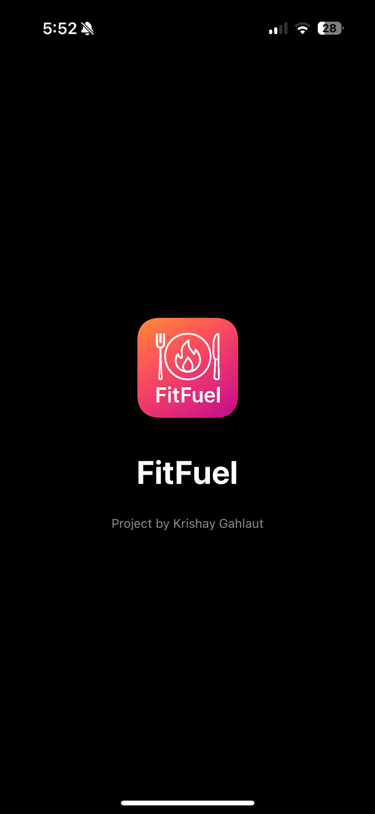
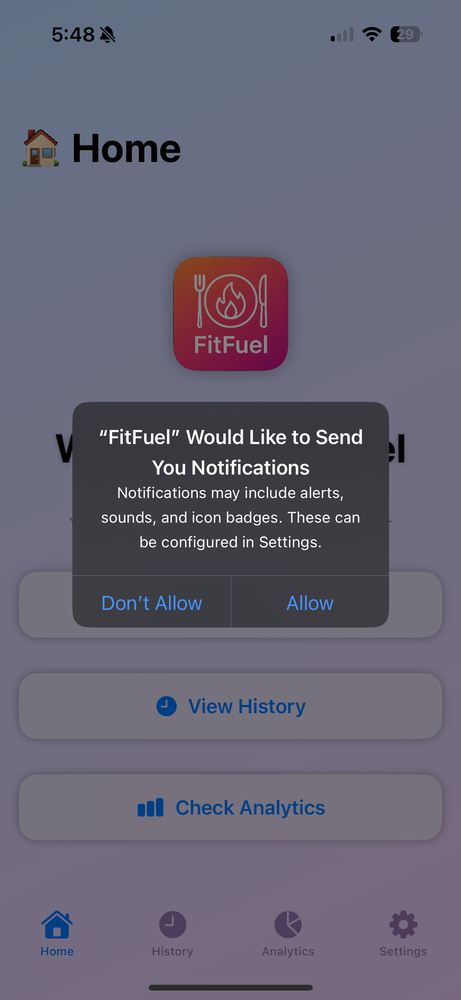
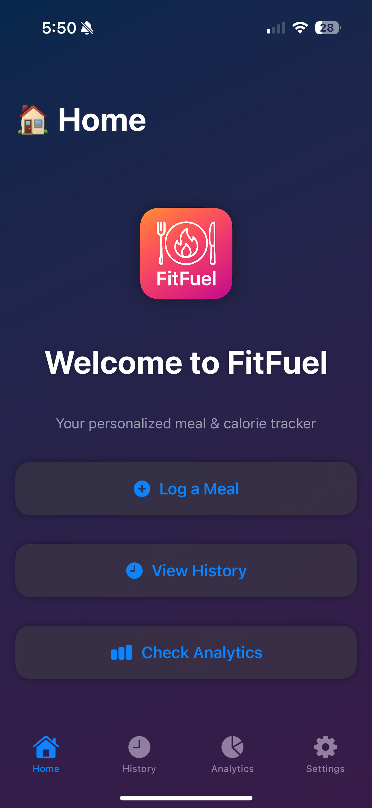
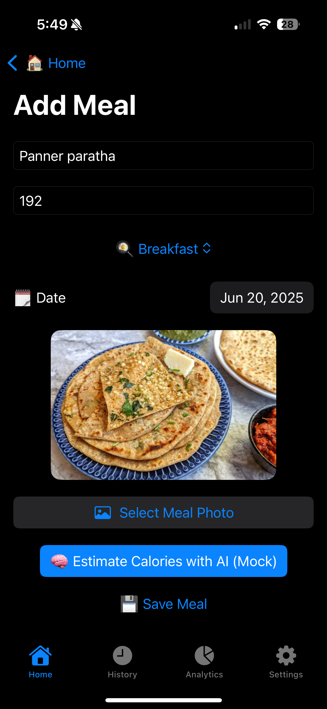
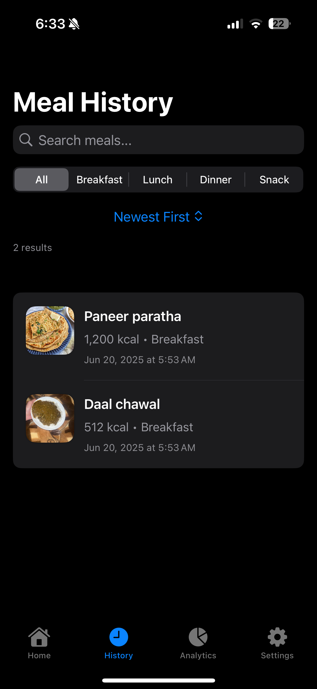
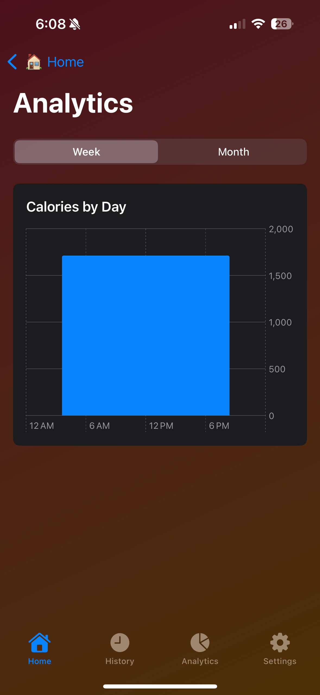
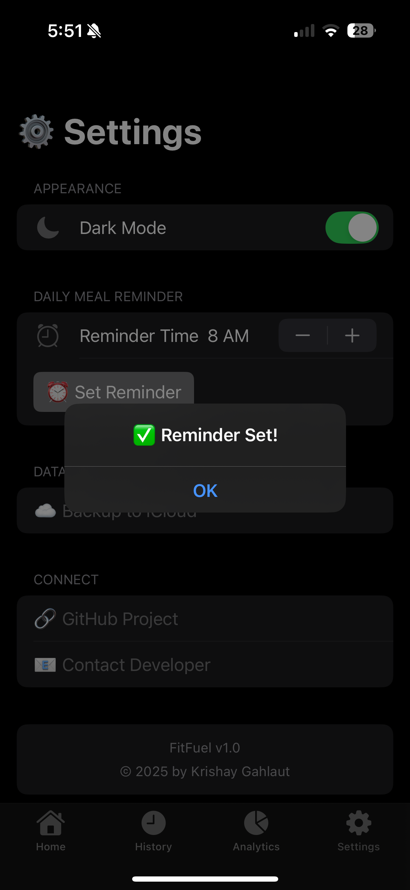
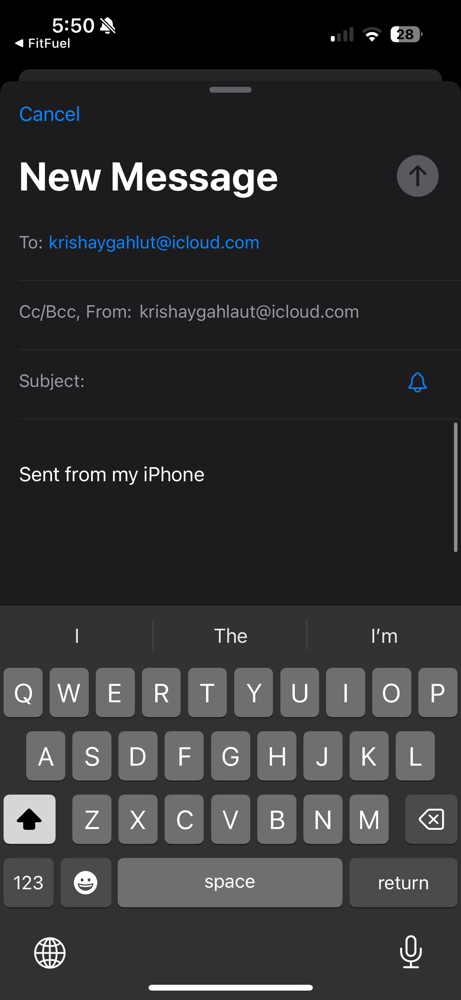

📱 FitFuel

Your Smart Meal Logger & Calorie Tracker

FitFuel is a beautifully designed iOS app built in SwiftUI that helps you track meals, estimate calories, analyze nutritional habits, and stay consistent with reminders. Fully offline, privacy-first, and blazing fast.

⸻

🧠 Features
	•	🍽️ Log Meals — Add meal title, category, calories, date, and optional photo
	•	🧠 AI Calorie Estimation (Mock) — One-tap estimate using mock AI
	•	📸 Image Attachment — Attach and preview meal photos
	•	📅 Meal History — View meals with calories, date, and photos
	•	📊 Analytics — Weekly/monthly trends with charts
	•	🔍 Search & Filter — Filter meals by title, category, or date
	•	🗑️ Swipe to Delete — Remove meals with swipe gesture
	•	🌓 Dark Mode Toggle — System-wide or manual control
	•	🛎️ Daily Reminders — Set your preferred meal reminder time
	•	☁️ Ready for iCloud Sync (Future scope)

⸻

🌄 Screenshots

  
  
  
  

  
  
  
  

⸻

🛠 Built With
	•	SwiftUI
	•	MVVM Architecture
	•	PhotosUI / Charts / AppStorage
	•	Local Notifications (UNUserNotificationCenter)
	•	Mock AI (replaceable with GPT)

⸻

🚀 Getting Started
	1.	Clone the repo: git clone https://github.com/krishaygahlaut/FitFuel.git
	2.	Open FitFuel.xcodeproj in Xcode 15+
	3.	Run on simulator or device (iOS 17+)
	4.	Tap around to log meals, switch modes, and explore analytics

⸻

🙌 Acknowledgments
	•	Built by Krishay Gahlaut
	•	Logo generated using AI and refined in Photoshop
	•	Special thanks to the iOS community ❤️

⸻

📄 License

This project is licensed under the MIT License. See LICENSE for details.